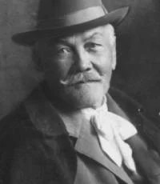

# P. O. Hviezdoslav's works

This repository contains collection of most of the poetic works by the Slovak poet [Pavol Országh Hviezdoslav](https://en.wikipedia.org/wiki/Pavol_Orsz%C3%A1gh_Hviezdoslav). The purpose of this collection is to fine-tune a language model to generate poetry in style of P. O. Hviezdoslav.


## Prerequisites

To run the scripts, you need to install packages from `requirements.txt`:

```bash
pip install -r requirements.txt
```


## Dataset building

The dataset was built in several steps:

### HTML dataset

The data were initially downloaded from [Zlatý fond SME](https://zlatyfond.sme.sk/autor/56/Pavol-Orszagh-Hviezdoslav) using the script `download_html.py` and stored in the `./books_html` folder, where each file represents one book. The book "1869. (II.)" cannot be downloaded programmatically and must be downloaded manually.


### Plain text dataset

The HTML files were then converted to plain text using the script `html_to_text.py` and stored in the `./books_txt` folder. 
At the same time, the text was cleaned of unnecessary parts (e.g., references and footnotes), various special characters were
replaced with their ASCII equivalents, and the text was split into individual chapters/poems. The manually downloaded book 
"1869. (II.)" was cleaned and incorporated into the dataset. Books "Herodes a Herodias", "Vzhledanie", and "Korešpondencia 
P. O. Hviezdoslava so Svetozárom Hurbanom Vajanským a Jozefom Škultétym" were excluded from the dataset due to their mostly non-poetic nature. Finally, the ZIP archive `books_txt.zip` was created from the remaining books. 

### Dictionary

Footnotes were extracted from the automatically downloaded books in HTML format using `extract_footnotes.py` and combined with the manually downloaded footnotes from the book "1869. (II.)". Then, the dictionary `dictionary.csv` of terms defined in the footnotes was created using `footnotes_to_dictionary.py`.